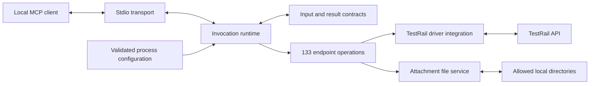

# TestRail MCP server architecture

Status: accepted implementation architecture, 2026-09-09. Implementation and release verification remain to be completed; the product decisions below are settled.

## Purpose and release scope

- Build the TestRail MCP server in `dichovsky/testrail-mcp`.
- Expose TestRail capabilities to MCP clients through explicitly described interfaces.
- Use [`dichovsky/testrail-api-client`](https://github.com/dichovsky/testrail-api-client) as the TestRail driver.
- Produce an implementation plan and publish actionable implementation items as GitHub issues in this repository.
- Keep domain terminology in the root glossary, operational details in the implementation contracts, and executable work items in the implementation plan and GitHub issues.

The server is a local adapter between MCP clients and the TestRail API. It translates typed endpoint tools into calls to the required driver, enforces the MCP input and result contracts, and manages local attachment files. TestRail remains the system of record and the authority for the configured user's permissions.

The first release targets TestRail **10.7.0**. Older TestRail versions are supported on a best-effort basis: preserve compatible responses and surface unavailable endpoints, parameters, permissions, and license requirements clearly. Do not promise full endpoint availability on older versions or infer compatibility merely from a successful connection. A later compatibility guarantee requires explicit version-specific verification.

## Runtime and component boundaries

Use TypeScript compiled to ESM, with Node engines `^22.13.0 || >=24`. Run the release test matrix on Node 22 and 24; an engine range that admits another Node version is not a claim that it has been certified. The planned npm package is `@dichovsky/testrail-mcp`, exposing the `testrail-mcp` executable.

Use the official `@modelcontextprotocol/server` SDK pinned to **2.0.0**, with `@modelcontextprotocol/client` **2.0.0** for protocol tests. Host the server through `serveStdio(factory)` and retain its default legacy compatibility. Test both the earlier initialization flow and MCP 2026-07-28 discovery; do not assume that a required client uses the modern revision by default. The [released stdio entry point](https://raw.githubusercontent.com/modelcontextprotocol/typescript-sdk/@modelcontextprotocol%2Fserver@2.0.0/packages/server/src/server/serveStdio.ts) supports both.

Pin `@dichovsky/testrail-api-client` to **7.0.0** for initial development and deterministic contract tests. This is not an acceptable final production dependency until the required upstream fixes are published and adopted. The production release must consume an exact published driver version containing the network-guard fixes identified after 7.0.0, the fixes preventing report execution from being cached/coalesced/retried, and the public per-operation result/settlement handle specified in the contracts. F03 runtime completion depends on this qualified driver through F01; a public method deadline can otherwise reject before its DNS/fetch/body descendants settle. Re-run parity and contract tests against that exact version before release. Do not substitute a floating branch, an independent HTTP implementation, or silent omission of affected endpoints. See [implementation contracts](implementation-contracts.md) and [implementation plan](implementation-plan.md) for the release dependencies and verification.

Proposed source boundaries:

| Location | Responsibility |
| --- | --- |
| `src/cli.ts` | Composition root: load configuration, create the process-owned runtime and driver, start stdio, and coordinate shutdown. |
| `src/config/` | Parse environment variables and validate immutable instance, credential, directory, and budget configuration. It does not make TestRail requests. |
| `src/driver/` | Construct and dispose of the required public client; apply supported driver options and expose injection seams for tests. Own the small integration needed for driver errors and invocation-scoped advisory validation. |
| `src/runtime/` | Admission and capacity accounting, per-call context, budget enforcement, warning isolation, diagnostics, cancellation state, and result/error completion. Own shared execution policy rather than duplicating it across 133 handlers. |
| `src/operations/` | Domain-grouped endpoint definitions and the canonical registry: tool names, route/method identity, effect classification, schemas, pagination capability, annotations, and explicit public driver-method bindings. |
| `src/contracts/` | Runtime input validation, the stable result wrapper, outer response checks, advisory entity-drift handling, pagination metadata, and sanitized error/warning contracts. |
| `src/files/` | Upload containment and file validation, download naming and exclusive creation, byte limits, incomplete-file cleanup, and persistent successful files. |
| `src/transport/` | MCP server construction and registration, SDK stdio wiring, and protocol lifecycle adaptation. It contains no TestRail endpoint logic. |

Configuration flows into the process runtime once. The server factory registers the same operation catalog around that runtime without contacting TestRail during discovery. The process owns the driver lifetime; construction or disposal of an SDK protocol instance must not accidentally create another credential identity or destroy shared driver state. Endpoint executors use common contracts and policies, with file operations delegated to `src/files/` and all TestRail traffic delegated to the driver.

The registry is the single source for registration, generated endpoint documentation, and coverage comparison. It is not a generic request dispatcher exposed to callers: users provide typed endpoint arguments, never an arbitrary URL or raw driver method name. Shared helpers may encode repeated mechanics, but endpoint-specific requirements remain explicit and independently verified.

## Operational contracts

The exact configuration keys, budgets, result fields, error taxonomy, freshness rules, retry policy, and file algorithms are defined in [implementation-contracts.md](implementation-contracts.md). Changes to those details must preserve the accepted behavior in this architecture. Client examples and test scenarios live in [client-compatibility.md](client-compatibility.md).

### First-release deployment

The first release runs locally over stdio. Each MCP host launches its own server process, configured with one TestRail instance and one user's TestRail credentials. TestRail itself may be hosted remotely.

The host owns the subprocess lifecycle. The server owns its driver instance and cleans it up during shutdown. Standard output is reserved for MCP protocol messages; diagnostics use standard error.

The release does not require a shared HTTP service, centralized credential storage, or service-user authentication. These may be considered in a later release. Transport-specific startup should remain separate from tool definitions so a later transport can reuse the tool layer.

Configure the instance with `TESTRAIL_BASE_URL`, `TESTRAIL_EMAIL`, and `TESTRAIL_API_KEY`; configure attachment boundaries with `TESTRAIL_MCP_UPLOAD_ROOTS` and `TESTRAIL_MCP_DOWNLOAD_DIR`. Keep credentials out of tool arguments, responses, and diagnostics. Configuration validation must fail clearly before serving tools when required values are invalid.

### First-release API coverage

The first release must provide full TestRail API coverage through the required driver. A release limited to core QA workflows does not meet the requirement.

The coverage baseline is the driver's TestRail 10.7.0 endpoint inventory at commit `89f636e276ea701412bb06039e3b963d83126ea1`: 133 REST endpoints across 28 API resource groups, implemented through 19 driver modules. The inspected inventory reports a client binding for every endpoint. Keep this versioned endpoint baseline distinct from the exact published driver dependency selected for development or release.

Coverage includes reads, creation, updates, bulk operations, moves/copies, closing and deletion, administration, plan entries and configuration matrices, attachments, BDD, shared steps, datasets, variables, labels, reports, and metadata wherever the TestRail API exposes them. Supported parameters, custom fields, and applicable pagination and binary transfers are part of coverage; endpoint names alone are insufficient.

Every baseline endpoint must map to a callable MCP operation, with input/output contracts, validation, error behavior, and verification in the implementation plan. Track endpoint parity in [the coverage matrix](api-coverage.md). Driver convenience methods such as page/all projections are options of the corresponding endpoint tool as defined below, not additional REST endpoint tools.

Release acceptance requires an automated comparison between the versioned endpoint baseline and the MCP operation registry, plus contract verification for every operation. A matching endpoint count alone is insufficient: missing routes, duplicate mappings, and omitted supported parameters must be detected. Work may be implemented in successive issues, but the first full release is complete only when the entire baseline is covered.

All implemented operations are enabled by default, as specified below. TestRail's own permissions, license, and version constraints continue to apply and must be reported clearly.

If a supported TestRail endpoint or parameter is missing from the selected driver version, record the gap as a release dependency and plan a driver enhancement. Do not silently omit it or bypass the required driver with a separate HTTP implementation.

### Operation-access default

All API operations are enabled by default, including creation, updates, bulk operations, administration, closing, and deletion. Destructive operations do not require a startup opt-in or a server-added per-call confirmation step.

The MCP server uses the configured user's TestRail credentials, and TestRail enforces that user's permissions. Tool descriptions and MCP annotations must accurately communicate each operation's effects. These annotations describe behavior; they are not an additional server authorization gate. Any permission prompts imposed by an MCP host remain under that host's control.

Input validation, credential protection, and accurate handling of failed or indeterminate writes still apply to every operation. Attachment tools follow the local-file contract below, including its configured directory boundaries.

Classify MCP effects from the complete tool behavior, including local filesystem changes, separately from TestRail mutation and retry classification. Report-execution endpoints can initiate work despite using GET; their annotations and driver policy must reflect those effects. The required upstream report fixes are a production release gate, not a reason to label these operations read-only. Attachment downloads also use `readOnlyHint: false`, `destructiveHint: false` and `idempotentHint: false`, because each call creates a new persistent local file. Their upstream request remains an ordinary TestRail GET.

### One tool per API endpoint

Expose one MCP tool for each of the 133 baseline REST endpoints. Name tools `testrail_<endpoint_operation>`, preserving the TestRail operation token: for example, `testrail_get_case`, `testrail_add_case`, and `testrail_delete_case`. Path parameters become typed tool arguments. The coverage matrix records the exact names.

Each tool has an operation-specific input contract, result contract, description, and behavior annotations. A shared operation registry binds these definitions to public driver methods and supports registration, documentation, and automated coverage verification. Group implementation modules by domain internally; public resource-plus-action dispatchers are not part of the selected design.

Pagination helpers are exposed through the corresponding list tool's options as described below; they do not create duplicate endpoint tools. Composed workflows are not required for REST endpoint parity and must not silently expand the release commitment.

Validate the full catalog with the intended MCP clients. Neither lower context usage nor better model accuracy is established merely by choosing this organization. See [ADR 0001](adr/0001-endpoint-tools.md) for the trade-off behind the public contract.

Protocol basis: MCP defines input/output schemas and annotations on each [tool definition](https://modelcontextprotocol.io/specification/2026-07-28/server/tools); [tool annotations](https://modelcontextprotocol.io/specification/2026-07-28/schema#toolannotations) are hints, not enforcement mechanisms.

### List pagination

List tools return one page by default. On the 18 lists with caller-controlled pagination, the default page size is 50 items; callers may select a supported page size and offset within the driver's limits. Return the available pagination metadata and clear continuation information with the items. Never imply that one page is the complete matching dataset when continuation exists.

The 24 lists with driver aggregation support also expose an explicit fetch-all option on the same endpoint tool. Fetch-all uses the driver's bounded aggregation with item, byte, duration, and page limits. It either returns the complete aggregate within those limits or reports a clear error, including the driver's available reason and progress counts; it does not silently return a truncated aggregate. Keep the original filters throughout aggregation.

The six response-driven lists (variables, datasets, shared-step history, roles, groups, and case statuses) do not accept manual page-size, offset, or continuation arguments in the current public page methods. Their default call returns the initial page at the server-selected size; fetching beyond it requires the explicit bounded fetch-all option. Tool descriptions and results must make this limitation clear. Do not advertise a resumable cursor, cache whole collections for local paging, or reimplement low-level pagination to conceal this driver constraint.

Lists without page/all helpers retain their supported one-response behavior; do not invent pagination or aggregation support. Distinguish terminal legacy arrays from server pagination envelopes, and preserve supported filters even where the endpoint lacks the page/all projections. A legacy terminal response describes the driver's observed response contract, not an independently verified snapshot of all upstream state.

Apply the aggregate budgets, continuation fields, and oversized-response behavior in the [implementation contracts](implementation-contracts.md). Budget enforcement must not erase filters or silently turn an incomplete response into a complete dataset.

### Attachment files

Attachment uploads accept a local file path within configured allowed upload directories. Pass the verified file to the driver's streamed file-upload interface. Directory checks must apply to the resolved file location, with regular-file validation and protection against traversal and symlink escapes; CLI filesystem checks are not inherited by this MCP adapter.

Attachment downloads write a uniquely named file inside a configured attachment directory. Return its absolute local path, TestRail attachment ID, and measured byte count only after the entire file has been written successfully. Use exclusive file creation so downloads do not overwrite existing files, and remove incomplete files after failed writes. Paths in results refer to the filesystem shared by the local server and its consumer.

The driver returns download bytes in memory, so its binary-response limit bounds that allocation; saving to disk does not make the network download streaming. The MCP result does not embed the complete file as base64. The driver does not provide the original filename or media type in its download result, so do not invent them. Optional verified metadata can be included only when its source is clear.

Successfully downloaded files persist until the user removes them. Server shutdown and restart must not delete them. The server owns cleanup of unsuccessful download attempts, not retention cleanup of completed downloads.

Use the directory configuration and file-size limits in the [implementation contracts](implementation-contracts.md). Attachment operations remain enabled under the accepted access default and do not add per-call confirmation requirements.

### JSON responses and custom fields

Preserve the field names and values returned by the driver, including additional TestRail response fields and flat `custom_*` properties. Place returned data in a stable MCP result wrapper with `data`, plus `pagination` and `warnings` when applicable. Keep TestRail data separate from the wrapper's own metadata. Do not rename, drop, coerce, or relocate custom fields into a new `custom_fields` container; preserve such a legacy container only if it was actually returned.

Validate tool inputs at runtime before invoking the driver: path identifiers, known query fields, and write payloads must meet their declared contracts. Reuse exported driver payload schemas while adding missing MCP boundary checks, and retain permitted custom fields. TypeScript declarations alone do not validate model-supplied JSON, and the driver does not uniformly validate programmatic write payloads. Instance-specific field requirements and permissions remain subject to TestRail's validation.

Validate the MCP wrapper and each operation's required outer response structure independently of its advisory entity-field schema. When a usable response disagrees with expected entity-field types, preserve the returned values and report a warning. Do not accidentally restore strict entity validation through an MCP output schema. Output descriptions and examples can document expected fields without making response drift an automatic outage.

Invalid collection/page structures and unusable responses remain errors. A successful upstream mutation whose response is unusable can have an indeterminate outcome: reporting that error must not claim that no change occurred or advise an unconditional retry. Schema warnings must be scoped to the originating call and avoid copying raw response data, arbitrary field names, or sensitive content into diagnostics.

Use the exact wrapper variants, warning/error codes, output limits, and structured/text representations in the [implementation contracts](implementation-contracts.md). Response-size failures after a mutation require the same truthful treatment of upstream effects as other unusable mutation responses.

### Execution policy and lifecycle

Validate each call before invoking its endpoint binding. Do not add transactions, automatic rollback, workflow expansion, or synthesized cross-endpoint retries. Bulk endpoints retain TestRail's documented request and response semantics; the MCP server must not describe a bulk request as atomic unless the endpoint actually guarantees that behavior.

Use only the caching, rate, and retry behavior explicitly configured through the driver and recorded in the implementation contracts. Keep read freshness visible and distinguish ordinary reads from effectful GET operations. Do not introduce a second hidden cache or retry layer in MCP handlers. An API rejection, an invocation that was never dispatched, and a response lost after a potentially successful write are different outcomes.

Cancellation stops admission and further adapter work where possible, but the inspected driver has no public per-operation abort signal and its disposal does not promise to abort in-flight requests. Do not destroy the shared client to cancel one call or claim that cancellation undid an accepted write. Enforce bounded work and shutdown according to the contracts, track outstanding invocations, and avoid sending results for cancelled MCP requests. Disable driver-owned process handlers so the CLI composition root coordinates cleanup once.

### Required MCP clients

Required local test surfaces are Codex desktop, Codex CLI, Claude Code, and GitHub Copilot CLI. These targets do not imply support has already been verified for every client version, model, provider, or organizational policy.

Provide client-specific local stdio configuration examples and record actual client versions/settings with compatibility results. Verify startup, complete tool discovery, representative calls across the catalog, structured/text result consumption, pagination, preserved custom fields, structural errors, file uploads/downloads, and shutdown. Independent protocol and driver-contract tests must cover every endpoint even where human-facing smoke tests use representative workflows.

The server exposes all 133 endpoint tools regardless of host context limits. Test each selected client's discovery behavior with the complete catalog and its supported deferred-tool loading, recording the client version, model, and relevant settings. Do not silently drop endpoints or split them into resource dispatchers to accommodate a client. The previously researched VS Code request limit is not a Copilot CLI limit or a release requirement for the replacement target.

Copilot CLI supports local stdio servers and uses its own MCP configuration, including `tools: ["*"]` to enable every server tool. Its examples must use CLI-supported configuration rather than `.vscode/mcp.json`. Preserve automatic deferred discovery (`deferTools: "auto"`) and test it with a supported CLI/model combination. Align its configured timeout with server operation budgets, and verify its handling of large tool results, which it may save to a temporary file with a preview. This change of client target does not require a server transport or endpoint-contract change.

Client policies may still require server trust or invocation approval. The server's accepted all-enabled policy introduces no additional confirmation layer, and its installer must not silently override a host's user-controlled trust or approval settings. Configure the documented 120-second client tool timeout and preserve automatic discovery; record any additional settings needed to consume bounded results without losing their data or metadata.

Sources and implementation-ready setup/test instructions are recorded in [client-compatibility.md](client-compatibility.md). No compatibility claim is complete until the required evidence has been recorded.

## Verification and release acceptance

Build deterministic tests around the real driver with injected HTTP/DNS dependencies. Cover all 133 endpoint bindings, supported parameters, input validation, wrappers, warning/error behavior, and special identifiers. Separately test actual packaged stdio startup, both protocol generations, full-catalog discovery, and subprocess lifecycle. Use the client verification matrix for model-facing behavior and live TestRail 10.7.0 smoke evidence.

Release acceptance requires:

- Exact endpoint/parameter parity with the versioned baseline, with no missing routes, duplicate bindings, hidden operations, or unsupported parameter claims.
- Passing deterministic contracts for every endpoint, including administrative and destructive operations against synthetic upstream fixtures.
- Passing pagination, field-preservation, response-structure, attachment containment/lifetime, budget, cancellation, and indeterminate-outcome tests.
- A published, exactly pinned driver release containing the required network and report-execution fixes and public operation-settlement API, followed by rerun integration tests.
- Passing Node 22/24 checks and recorded results for each required client surface with the complete catalog.
- A packed npm executable, configuration examples, sanitized diagnostics, and documented TestRail/version/permission limitations that match verified behavior.

Do not turn unavailable live infrastructure or an untested client into a passing result. TestRail permissions and licenses can limit live smoke coverage; distinguish that coverage from the exhaustive fixture-based adapter contract tests. No live production writes are necessary to verify destructive endpoint mappings.

## Related implementation documents

- [Domain glossary](../CONTEXT.md): canonical domain terms only.
- [Endpoint coverage matrix](api-coverage.md): the versioned 133-operation inventory.
- [Implementation contracts](implementation-contracts.md): exact runtime and data contracts.
- [Client compatibility plan](client-compatibility.md): configuration, test scenarios, and evidence.
- [Implementation plan](implementation-plan.md): dependencies, work items, acceptance criteria, and GitHub issue links.
- [Endpoint-tool ADR](adr/0001-endpoint-tools.md): rationale for the selected public tool organization.
- [Research notes](research-notes.md): dated source evidence and driver observations.
